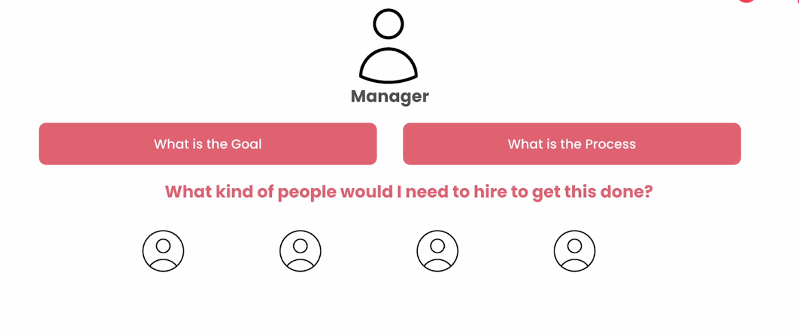
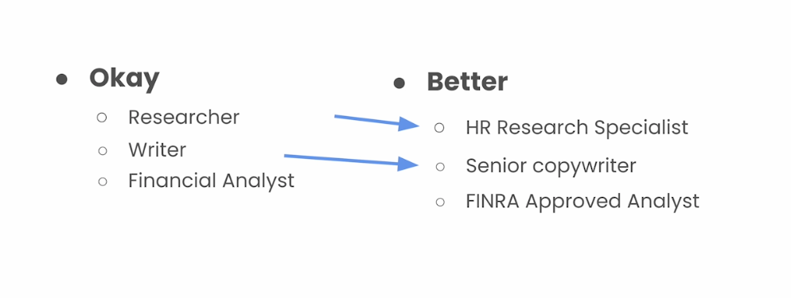
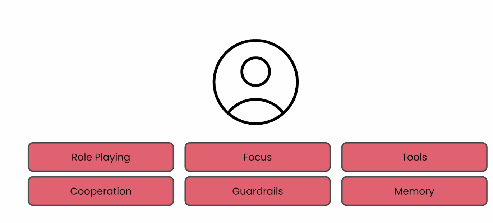
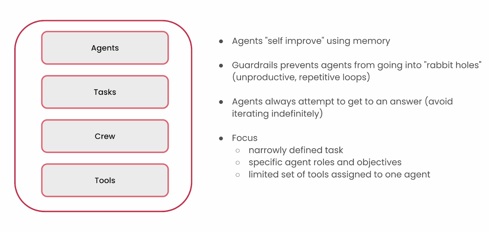

## Mental framework for Agent Creation

- Think like a manager

Think very carefully about the roles and the responsibilities of these people who as a manager would likely to hire, and then frame that for example as follows:

Good Agents should have following:

